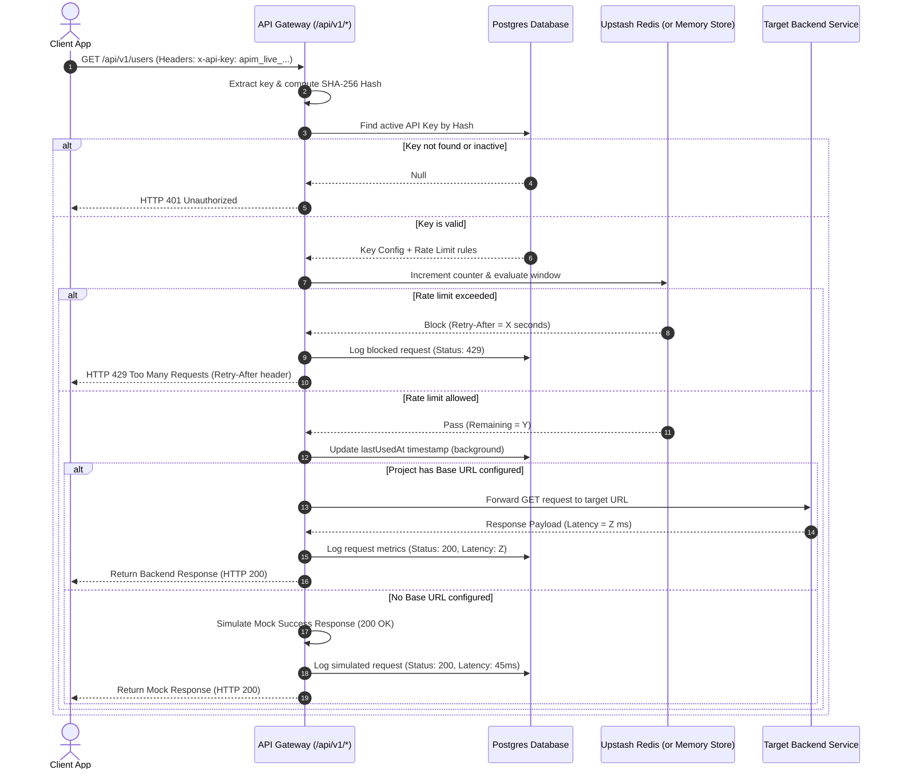

# System Architecture

This document describes the codebase structure, component relations, data flow, and runtime boundaries of the APIMon platform.

---

## 🏗️ Folder Structure

The application is structured inside a modern Next.js `src/` directory layout:

*   `src/app/`: Next.js App Router routes, API handlers, and UI pages.
    *   `src/app/api/auth/`: Credentials signup, login, logout, and session status handlers.
    *   `src/app/api/projects/`: Projects listing, creation, and settings update.
    *   `src/app/api/api-keys/`: Secure key generation, regeneration, and RBAC controls.
    *   `src/app/api/v1/[...path]/`: API Gateway dynamic dynamic-catch route for rate limiting and proxying.
    *   `src/app/api/ai/analyze/`: Gemini API integration for generating performance reports.
    *   `src/app/dashboard/`: UI pages for overview metrics, analytics, logs, keys, and settings.
*   `src/components/`: Reusable React components (Dashboard Shell, Command Palette).
*   `src/lib/`: Reusable utilities and context wrappers (DB connection, Auth Context, Rate Limiting engine).
*   `prisma/`: Prisma 7 Database schema configurations.

---

## 🔄 Core Data Flow

APIMon acts as an intelligent API Gateway in front of user backends. The diagram below details the route validation and rate limiting sequence when a request hits the gateway:

---

## 🔒 Security Design

1.  **API Key Hashing**: Plain-text keys are generated once on the client and are never stored in the database. Instead, a fast and secure cryptographic hash (SHA-256) is computed and stored. Gateway requests compute the SHA-256 hash of the header token and match it against the DB index in $O(1)$ time.
2.  **Session Authentication**: Built with secure HTTP-only cookies signed by the server (`apimon_session`) containing database-backed session tokens.
3.  **RBAC Rules (Role-Based Access Control)**:
    *   `OWNER`: Full project access, billing controls, and deletion privileges.
    *   `ADMIN`: Can invite team members, configure endpoints, and generate API keys.
    *   `MEMBER`: Can view request logs, check analytics dashboards, and read key configurations.
4.  **Database Protection**: SQL injection protection is enforced natively via Prisma's typed parameterization. Input sanitization is done with strict Zod validation schemas.
